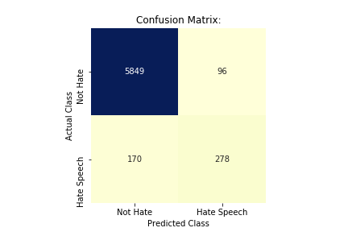

# Combating the Spread of Misinformation and Extremism in a Networked World

## Background:  

Reported incidents of hate speech and hate crime have been growing in the United States and around the world in in recent years. Research indicates that one of the factors that has lead to this spike is the growing presence and influence that technology -- and in particular, social media platforms -- has had on people's daily lives. Online forums have provided a safe space for people to share extremist viewpoints without a fear of retribution, allowing them to cultivate followers more easily than than ever. Further, social media platforms are designed with the purpose of sharing content, and the more that individuals are exposed to extreme views, the less resistent they become to them -- including calls to participate in bigotry, hatred and violence in offline spaces.

  
  
  

## Challenges for Tech Giants in Monitoring Online Content:

For all the advances being made in the field, artificial intelligence still struggles when it comes to identifying hate speech. When he testified before Congress in April 2018, Facebook CEO Mark Zuckerberg said that this was “one of the hardest” problems to solve.  Since humans can’t always agree on what can be classified as hate speech, it is especially complicated to create a universal machine learning algorithm that can accurately identify it.

## Project Goals:

My goals for this project were to identify practical steps that an individual or business can take in order to track and analyze user comments on their platforms, as well as effectively censor hate speech sentiment.

## Dataset:

The dataset used for this project was obtained through the [Analytics Vindhya website](https://datahack.analyticsvidhya.com/contest/practice-problem-twitter-sentiment-analysis/#data_dictionary). The publicly available portion of this dataset consists of ~32,000 tweets that have been pre-labeled as "not hate speech" or "hate speech" (i.e., includes racist or sexist content). No details on the methodology used to pre-label the tweets was provided.

## Data Preparation and Exploration:

The frequency of word counts and phrases, as well as predictive word embeddings for each class were explored and can be found in the "Data Exploration" folder. As can be seen below, tweets pre-labeled as "hate speech" had a higher proportion of words related to race, ethnicity and gender than the "not hate" tweets.

Pre-labeled as "Not Hate" Tweets:

Pre-labeled as "Hate Speech" Tweets:

## Predictive Model Training:

The performance of six classifiers (Multinomial Naive Bayes, Support Vector Machine, Logistic Regression, Random Forest, AdaBoost and XGBooster) were compared for this project.

A wide variety of text pre-processing and feature engineering techniques were utilized and compared in order to improve classifier performance, including:

- Stemming and Lemitization 
- Text Vectorization Methods: Bag of Words, Tf-idf, and n-grams
- Word Embeddings: Word2Vec and pre-trained [GLoVe](https://nlp.stanford.edu/projects/glove/) word vctors

A broad range of techniques to address the severe imbalance in class size were also compared in the training phase, including: oversampling, undersampling, SMOTE (synthetic oversampling minority technique), and the use of class weights. 

Finally, a grid search or randomized search was conducted to fine-tune the remaining hyperparameters for each model, and the probability threshold for classification was adjusted, as applicable, to maximize F1 score performance. 

## Final Model Selection: 

The best performing model on the the testing data was a logistic regression classifer, using a simple word frequency vectorizer (count vectorizer) and oversampling on the training set in order to correct for the class imbalance. The probability threshold used to determine binary classification was lowered to .20 during the model training phase in order to reduce the number of false negatives and false positives.  

Final metrics were as follows: Accuracy: 0.96, Precision: 0.74, Recall: 0.62, F1: 0.68

## Discussion:

The final logistic regression model showed a small improvement over the baseline model in accuracy at 96% (versus 93%). Attempts were made to improve precision and recall metrics for each of the classifiers in the training stage by correcting for class imbalances and fine-tuning of the hyperparameters, but these only made minor improvements to the model fit.

Investigation of the tweets misclassified by the final model suggests that the presence of specific words or phrases is not enough to accurately identify whether a tweet can be considered hate speech. For example, some of the tweets incorrectly classified as "hate speech" contained references to racial and religious groups that could be perceived as hate speech without considering word order and context in the statement. 

Interestingly, classifier performance using word embeddings from Word2Vec was not found to perform better predictions than a Bag of Words approach, which may be due to the inconsistent nature in which it seems the tweets were originally labeled as "hate" or "not hate". Furthermore, I found that using pre-trained embeddings from GloVe had little to no predictive value when testing my models, reiterating the unique nature of vocabularly that is used on social media platforms.

## Recommendations and Next Steps: 

This project highlighted many of the challenges that can exist for social media platforms in accurately identifying hate speech on their platforms, including the lack of universal agreement on what qualifies something as hate speech.  

In order to build better algorithms for detecting hate speech, companies should first ensure they have set clear and descriptive guidelines for people who are classifying the statements by hand. Requiring users to indicate why they are labeling a statement as hate speech (e.g., "contains racist content"), as well as the degree of the offense (e.g., "mild", "moderate", or "severe") can help companies train algorithms that are more sensitive to the complexities that exist with identifying and censoring hate speech content.

Second, this project highlighted the unique challenges in working with social media data, which can consist of the use of hashtags, emjois, and unique vernacular that can be used to escape automatic detection by algorithms.  While I made the decision not to break up hashtags into individual words because I felt it would change the context and meaning in which the tweets were constructed, this is another area for future exploration. 

  