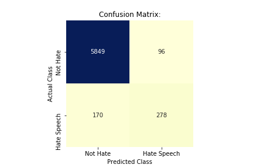

# Combating the Spread of Misinformation and Extremism in a Networked World

By: Manisha Gupta, Ph.D., Social Psychology (Concentration in Peace and the Prevention of Violence)

## Background:  

Reported incidents of hate speech and hate crime have been growing in the United States and around the world in in recent years. Research indicates that one of the factors that has lead to this spike is the growing presence and influence that technology -- and in particular, social media platforms -- has had on people's daily lives. Online forums have provided a safe space for people to share extremist viewpoints without a fear of retribution, allowing them to cultivate followers more easily than than ever. Further, social media platforms are designed with the purpose of sharing content, and the more that individuals are exposed to extreme views, the less resistent they become to them -- including calls to participate in bigotry, hatred and violence in offline spaces.

  
  
  

## Challenges for Tech Giants in Monitoring Online Content:

For all the advances being made in the field, artificial intelligence still struggles when it comes to identifying hate speech. When he testified before Congress in April 2018, Facebook CEO Mark Zuckerberg said that this was “one of the hardest” problems to solve.  Since humans can’t always agree on what can be classified as hate speech, it is especially complicated to create a universal machine learning algorithm that can accurately identify it.

## Project Goals:

My goals for this project were to identify practical steps that an individual or business can take in order to track and analyze user comments on their platforms, as well as effectively censor hate speech sentiment.

## Dataset:

The dataset used for this project was obtained through the [Analytics Vindhya website](https://datahack.analyticsvidhya.com/contest/practice-problem-twitter-sentiment-analysis/#data_dictionary). The publicly available portion of this dataset consists of ~32,000 tweets that have been pre-labeled as "not hate speech" or "hate speech" (i.e., includes racist or sexist content). No details on the methodology used to pre-label the tweets was provided.

## Data Preparation and Exploration:

The frequency of word counts and phrases, as well as predictive word embeddings for each class were explored and can be found in the "Data Exploration" folder. As can be seen below, tweets pre-labeled as "hate speech" had a higher proportion of words related to race, ethnicity and gender than the "not hate" tweets.

Pre-labeled as "Not Hate" Tweets:

Pre-labeled as "Hate Speech" Tweets:

## Classifier Training:

Seven classifiers were trained and tested for this project (Multinomial Naive Bayes, Support Vector Machine, Logistic Regression, Random Forest, AdaBoost, XGBooster, and a Recurrent Neural Network). More details on the performance of each classifier can be found in the "preliminary analyses" folder. 

A wide variety of text pre-processing and feature engineering techniques were utilized and compared in order to improve classifier performance, including:

- Stemming and Lemitization 
- Text Vectorization Methods: Count Vectorizer and TFIDF (with a range of 1-3 n-grams)
- Word Embeddings: I trained a Word2Vec model to obtain mean word embeddings specific to my dataset, and also employed transfer-learning techniques using pre-trained [GloVe](https://nlp.stanford.edu/projects/glove/) word vectors for Twitter

A broad range of techniques to address the imbalance in class size were also compared in the training phase for each classifier, including: oversampling, undersampling, SMOTE (synthetic oversampling minority technique), and the use of class weights. 

Finally, a grid search or randomized search was conducted to fine-tune the hyperparameters for each of the classifiers (except for the RNN, due to computational processing limitations), and the probability threshold for determining classification was adjusted, when applicable, to maximize F1 score performance. 

## Final Model Selection: 

The best performing model was a logistic regression classifier, using a simple word frequency vectorizer (count vectorizer). Oversampling was used on the training data in order to help correct for the class imbalance.  The probability threshold for classifying a tweet as being "hate speech" was also lowered to .20 during the training phase in order to maximize F1 score.

Final scores on the test data were as follows: Accuracy: 96%, Precision: 74%, Recall: 62%, F1: 68%

## Discussion:

The final logistic regression model showed a small improvement over the baseline model in accuracy at 96% (versus 93%). Attempts were made to improve precision and recall metrics for each of the classifiers in the training stage by correcting for class imbalances and fine-tuning of the hyper-parameters, but these only made minor improvements to the model fit.

Investigation of the tweets misclassified by the final model suggests that the presence of specific words or phrases is not enough to accurately identify whether a tweet can be considered hate speech. For example, some of the tweets incorrectly classified as "hate speech" contained references to racial and religious groups that could be perceived as hate speech without considering word order and context in the statement. 

Interestingly, classifier performance using word embeddings from Word2Vec was not found to perform better predictions than a Bag of Words (Count Vectorizer) approach, which may be due to the inconsistent nature in which it seems the tweets were originally classified as "hate" or "not hate". Furthermore, I found that using pre-trained embeddings from GloVe did not increase the performance of the basic classifiers, which reiterates some of the difficulties in obtaining universal representations of language found on social media platforms. 

Finally, use of a Recurrent Neural Network, which allows for the order of the words to be taken into consideration when performing predictions, did not beat the performance of a simple logistic classifier on this dataset. While this seems surprising, existing research in this area suggests that simple classification models often outperform neural networks on text sentiment analysis tasks.

## Recommendations and Next Steps: 

This project reiterated many of the challenges that can exist for businesess in identifying hate speech on their platforms, including the lack of universal agreement on what qualifies something as hate speech.  

In order to build better algorithms for detecting hate speech, companies should first ensure they have set clear and descriptive guidelines for people who are classifying the statements by hand. Requiring users to indicate why they are labeling a statement as hate speech (e.g., "contains racist content"), as well as the degree of the offense (e.g., "mild", "moderate", or "severe") can help companies train algorithms that are more sensitive to the complexities that exist with identifying and censoring hate speech content.

Second, this project highlighted the unique challenges in working with social media data, which can consist of the use of hashtags, emjois, and unique vernacular that can be used to escape automatic detection by algorithms.  While I made the decision not to break up hashtags into individual words because I felt it would change the context and meaning in which the tweets were constructed, this is another area for future exploration. 

## Resources:

[Hate Lab:](https://hatelab.net) Hate Lab is a global hub for data and insight into hate speech and crime.

[PeaceTechLab:](https://www.peacetechlab.org/combating-online-hate-speech-main) Working to identify, monitor, and combat hate speech on social media.

[The Effect of Extremist Violence on Hateful Speech Online:](https://www.unglobalpulse.org/sites/default/files/The%20effects%20of%20extremist%20violence%20on%20hateful%20speech%20online.pdf) UN paper highlighting links between online hate speech and offline violence.

  